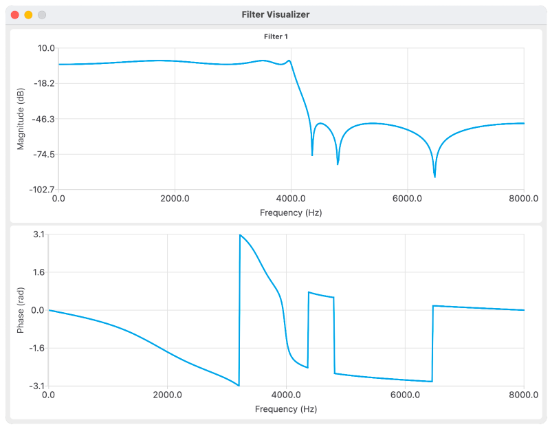

# Filter Visualizer

C++ library to display the frequency response of digital fiters in runtime. The primary goal is to plot the filter responses when debugging code. It may be especially useful for adaptive filters, which change over time.



The tool is designed as a shared library (`.dll`, `.so`, `.dylib`) in order to simplify the integration with external projects.

The ```example``` folder includes an example on how to use the tool to plot the filter responses from the code. It just requires to create a new instance of the ```FilterViz``` class. Note that the plot will pop up and will lock the execution of the main program until the window is closed (so obviously, it is not designed for real-time systems!).

## Tech Stack
- C++
- [Qt](https://www.qt.io/)
- [Cmake](https://cmake.org/)

## Supported platforms
*Filter Visualizer* is multiplatform and works in *Windows*, *Linux* and *macOS*.

## Requirements
- Qt >=5
- Cmake >= 3.16

## Usage
The repo includes some bash scripts as an example on how to build and run the code.

## To-Do list
- Add group and phase delay
- Add pole/zero plot
- Add some filter characteristics (stability, etc.)

## 3rd parties
- .gitignore taken from https://github.com/github/gitignore
- App icon taken from https://iconarchive.com/show/kameleon.pics-icons-by-webalys/Music-Equalizer-icon.html

## Author
Antonio Peiro ([LinkedIn](https://es.linkedin.com/in/antoniopeiro))